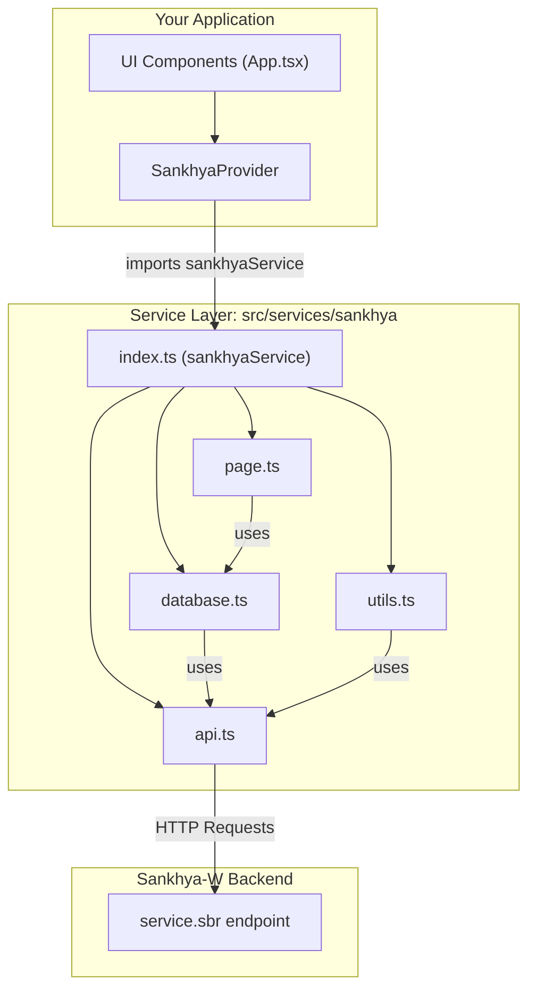

# Sankhya Service Layer

## Overview

This directory (`src/services/sankhya`) contains a modern, function-based service layer designed to interact with the Sankhya-W backend. This module abstracts the platform's specific service calls (e.g., `service.sbr?serviceName=...`) into a clean, reusable, and testable set of TypeScript functions.

This library is framework-agnostic (it's plain TypeScript) but is built to be easily integrated into any modern frontend application, such as React, that runs inside a Sankhya HTML5 component.

### Key Features

- **Modular:** Divided by concern (API, Database, Page, Utilities).
- **Modern:** Uses `async/await` and the `fetch` API for all asynchronous actions.
- **Strongly-Typed:** Written in TypeScript with JSDoc comments for a clear developer experience.
- **Centralized:** A single "barrel" file (`index.ts`) exports the entire service API as one object.
- **Abstracted:** Hides the complexity of Sankhya's JSON payloads for common actions like queries and saves.
- **React Integration:** Provides a Context Provider for easy use in React applications.

## File Structure

```
src/services/sankhya/
├── api.ts          # Low-level network functions (get, post, callService)
├── database.ts     # Data & CRUD actions (executeQuery, saveRecord, etc.)
├── page.ts        # Page navigation & DOM (removeFrame, openAppPage)
├── utils.ts       # General utilities (getParameter, getCookie)
└── index.ts       # Barrel file: Exports the complete 'sankhyaService' object
```

## Architectural Diagram

This diagram shows the dependency flow. The `api.ts` module is the foundation, and all other modules depend on it to communicate with the Sankhya backend. The `index.ts` file bundles everything for easy consumption by the application.



## Modules

### api.ts

This is the core of the service layer. It is the only module that directly performs network requests. All other modules use these functions.

#### Exported Functions

##### `post(url, body, options)`

Performs a generic POST request.

**Parameters:**

- `url` (string): The request URL.
- `body` (any): The request body.
- `options` (RequestOptions, optional): Additional options.
  - `headers` (Record<string, string>, optional): Request headers.
  - `raw` (boolean, optional): If `true`, returns the raw Fetch response.

**Returns:** `Promise<any>` - A Promise with the request response.

**Example:**

```typescript
const response = await sankhyaService.post("/mge/service.sbr", {
  serviceName: "MyService.execute",
  requestBody: { data: "value" },
});
```

##### `get(url, options)`

Performs a generic GET request.

**Parameters:**

- `url` (string): The request URL.
- `options` (RequestOptions, optional): Additional options.
  - `headers` (Record<string, string>, optional): Request headers.
  - `raw` (boolean, optional): If `true`, returns the raw Fetch response.

**Returns:** `Promise<any>` - A Promise with the request response.

**Example:**

```typescript
const data = await sankhyaService.get("/mge/data.json", {
  headers: { "Content-Type": "application/json" },
});
```

##### `callService(serviceName, data, additionalData)`

The main function for calling Sankhya-W services. Intelligently handles module routing (e.g., `mgecom@serviceName`), formats the request payload, and parses the response.

**Parameters:**

- `serviceName` (string): The name of the service to call (e.g., `"DbExplorerSP.executeQuery"` or `"mgecom@admin.getVersao"`).
- `data` (any): The data to send in the request body.
- `additionalData` (ServiceCallData, optional): Additional data for the request.
  - `application` (string, optional): Requesting application. Default: `'workspace'`.
  - `headers` (Record<string, string>, optional): Request headers.

**Returns:** `Promise<any>` - A Promise with the service response.

**Example:**

```typescript
// Default service (mge)
const response = await sankhyaService.callService("DbExplorerSP.executeQuery", {
  sql: "SELECT * FROM PRODUTO",
});

// Service from another module
const version = await sankhyaService.callService(
  "mgecom@admin.getVersao",
  {},
  { application: "MyApplication" }
);
```

**Error Handling:**

- Throws an error if `serviceName` is not provided.
- Throws the complete Sankhya error object if `status` is `0` or `3`.
- Logs warnings to console if `status` is `2` or `4`.

### database.ts

This module handles all data-centric operations (CRUD, actions). It uses `api.ts` to send its payloads.

#### Exported Functions

##### `executeQuery(query)`

Executes a SQL query using `DbExplorerSP.executeQuery`.

**Parameters:**

- `query` (string): The SQL query string to execute.

**Returns:** `Promise<any[]>` - A Promise with the query result (array of objects).

**Example:**

```typescript
// Simple query
const usuarios = await sankhyaService.executeQuery(
  "SELECT NOMEUSU, CODUSU FROM TSIUSU WHERE ATIVO = 'S'"
);

// Use the results
usuarios.forEach((usuario) => {
  console.log(`${usuario.NOMEUSU} (ID: ${usuario.CODUSU})`);
});
```

##### `saveRecord(data, instance, primaryKeys)`

Saves/updates a record using `CRUDServiceProvider.saveRecord`. Can save/update one or multiple records.

**Parameters:**

- `data` (Record<string, any>): The data object with fields to save.
- `instance` (string): The entity name (e.g., `"Produto"`).
- `primaryKeys` (Record<string, any> | Record<string, any>[], optional): The primary key(s) for update. If empty, creates a new record.

**Returns:** `Promise<any>` - A Promise with the save response(s).

**Example:**

```typescript
// Create a new record
await sankhyaService.saveRecord(
  { DESCRICAO: "New Product", ATIVO: "S" },
  "Produto"
);

// Update an existing record
await sankhyaService.saveRecord({ DESCRICAO: "Updated Product" }, "Produto", {
  CODIGO: 123,
});

// Update multiple records
await sankhyaService.saveRecord({ ATIVO: "N" }, "Produto", [
  { CODIGO: 123 },
  { CODIGO: 456 },
  { CODIGO: 789 },
]);
```

##### `saveRecordDataset(data, instance, primaryKeys)`

Saves or updates a record using `DatasetSP.save`. A more modern alternative to `saveRecord`.

**Parameters:**

- `data` (Record<string, any>): Data object with fields (e.g., `{ DESCRICAO: 'New' }`).
- `instance` (string): The entity name.
- `primaryKeys` (Record<string, any>, optional): Primary key(s) for update (e.g., `{ CODIGO: 123 }`).

**Returns:** `Promise<any>` - A Promise with the save response.

**Example:**

```typescript
// Create record
await sankhyaService.saveRecordDataset(
  { DESCRICAO: "New Item", VALOR: 100.5 },
  "Produto"
);

// Update record
await sankhyaService.saveRecordDataset(
  { DESCRICAO: "Updated Item" },
  "Produto",
  { CODIGO: 123 }
);
```

##### `deleteRecord(instance, primaryKeys)`

Deletes a record from the database using `DatasetSP.removeRecord`.

**Parameters:**

- `instance` (string): The entity name.
- `primaryKeys` (Record<string, any> | Record<string, any>[]): The primary key(s) of the record(s) to delete.

**Returns:** `Promise<any>` - A Promise with the deletion response.

**Example:**

```typescript
// Delete a single record
await sankhyaService.deleteRecord("Produto", { CODIGO: 123 });

// Delete multiple records
await sankhyaService.deleteRecord("Produto", [
  { CODIGO: 123 },
  { CODIGO: 456 },
]);
```

##### `triggerButtonAction(data, options)`

Remotely triggers a button action (ActionButtonsSP). Supports JavaScript, Java, and SQL actions.

**Parameters:**

- `data` (any): The data/context for the button action.
- `options` (ButtonActionOptions, optional): Configuration options for the action.
  - `type` ("js" | "java" | "sql"): Type of action. Default: `"java"`.
  - `buttonId` (number): Button ID. Default: `0`.
  - `entity` (string, optional): Entity name (required for SQL).
  - `procedureName` (string, optional): Procedure name (required for SQL).

**Returns:** `Promise<any> | undefined` - A Promise with the action response.

**Example:**

```typescript
// JavaScript action
await sankhyaService.triggerButtonAction(
  { parametro1: "valor1", parametro2: 123 },
  { type: "js", buttonId: 10 }
);

// Java action
await sankhyaService.triggerButtonAction(
  { codigo: 123 },
  { type: "java", buttonId: 5 }
);

// SQL action (Stored Procedure)
await sankhyaService.triggerButtonAction(
  { CODIGO: 123, STATUS: "A" },
  {
    type: "sql",
    buttonId: 15,
    entity: "Produto",
    procedureName: "SP_ATUALIZAR_PRODUTO",
  }
);
```

### page.ts

This module contains functions for interacting with the Sankhya-W page and navigation.

#### Exported Functions

##### `removeFrame(options)`

Removes the frame from a dashboard widget to load the application in full-screen.

**Parameters:**

- `options` (RemoveFrameOptions, optional): Configuration options.
  - `instance` (string, optional): The exact name of the BI component.
  - `initialPage` (string, optional): The URL of the initial page (e.g., `"app.jsp"`). Default: `"index.jsp"`.
  - `otherOptions` (any, optional): Additional fields to be passed as URL parameters.

**Returns:** `void`

**Example:**

```typescript
// Use automatic detection
sankhyaService.removeFrame();

// Specify options manually
sankhyaService.removeFrame({
  instance: "MyBIComponent",
  initialPage: "app.jsp",
  extraParam: "value",
});
```

##### `openAppPage(resourceID, primaryKeys)`

Opens a page within the Sankhya-W system (navigates the main window).

**Parameters:**

- `resourceID` (string): The resource ID of the page to open (e.g., `"br.com.sankhya.core.cad.marcas"`).
- `primaryKeys` (Record<string, any>, optional): Primary keys of the record to open.

**Returns:** `void`

**Example:**

```typescript
// Open generic page
sankhyaService.openAppPage("br.com.sankhya.core.cad.marcas");

// Open page with specific record
sankhyaService.openAppPage("br.com.sankhya.core.cad.produtos", { CODIGO: 123 });
```

##### `closeCurrentPage()`

Closes the current page. If inside Sankhya-W, closes the tab; otherwise, closes the browser window/tab.

**Returns:** `void`

**Example:**

```typescript
sankhyaService.closeCurrentPage();
```

##### `openInNewTab(forced)`

Opens the current page in a new tab.

**Parameters:**

- `forced` (boolean, optional): If `true`, forces opening in a new tab even if not inside the Sankhya frame. Default: `false`.

**Returns:** `void`

**Example:**

```typescript
// Automatic opening (only works inside frame)
sankhyaService.openInNewTab();

// Force opening
sankhyaService.openInNewTab(true);
```

### utils.ts

This module holds common utilities needed by the service layer.

#### Exported Functions

##### `getUrl(path)`

Returns the current page URL, optionally appending a path.

**Parameters:**

- `path` (string, optional): The path to append.

**Returns:** `string` - The full URL.

**Example:**

```typescript
const baseUrl = sankhyaService.getUrl();
const apiUrl = sankhyaService.getUrl("api/data.json");
```

##### `getCookie(name)`

Gets the value of a desired cookie by name. If no name is provided, returns all cookies as a string.

**Parameters:**

- `name` (string, optional): The name of the cookie.

**Returns:** `string` - The cookie value or an empty string if not found.

**Example:**

```typescript
// Get specific cookie
const sessionId = sankhyaService.getCookie("JSESSIONID");

// Get all cookies
const allCookies = sankhyaService.getCookie();
```

##### `getFileContent(filePath)`

Fetches the content of a file (e.g., text, JSON).

**Parameters:**

- `filePath` (string): The path to the file.

**Returns:** `Promise<any>` - A Promise with the file content.

**Example:**

```typescript
const content = await sankhyaService.getFileContent("/data/config.json");
```

##### `getParameter(parameterNames)`

Gets the value of one or more system parameters (`ManutencaoPreferenciasSP.getParametrosComoEstrutura`).

**Parameters:**

- `parameterNames` (string | string[], optional): A single parameter name or an array of names. If empty, fetches all.

**Returns:** `Promise<Record<string, any>>` - An object with parameter names as keys and their values.

**Example:**

```typescript
// Get a single parameter
const params = await sankhyaService.getParameter("PERCSTCAT137SP");
console.log(params.PERCSTCAT137SP);

// Get multiple parameters
const params = await sankhyaService.getParameter([
  "BASESNKPADRAO",
  "EMAIL_REMETENTE",
  "PERCSTCAT137SP",
]);
console.log(params.BASESNKPADRAO, params.EMAIL_REMETENTE);

// Get all parameters
const allParams = await sankhyaService.getParameter();
```

**Typed Values:**
The function automatically returns typed values:

- **Boolean (L):** Converts to `true`/`false`
- **Integer/Float (I/F):** Converts to `number`
- **Text (T):** Returns as `string`
- **ComboBox (C):** Returns the selected option as `string`
- **Date (D):** Converts to `Date` object

## Usage

### Direct Import

You can import the service directly:

```typescript
import { sankhyaService } from "./services/sankhya";

// Use the functions
const produtos = await sankhyaService.executeQuery(
  "SELECT * FROM PRODUTO WHERE ATIVO = 'S'"
);
```

### Usage with React Context

For React applications, it's recommended to use the provided Context Provider.

#### 1. Setup the Provider

In your main file (`main.tsx` or `App.tsx`):

```typescript
import { SankhyaProvider } from "./contexts/sankhya-context";

function App() {
  return <SankhyaProvider>{/* Your components here */}</SankhyaProvider>;
}
```

#### 2. Use the `useSankhya` Hook

In any child component:

```typescript
import { useSankhya } from "./contexts/sankhya-context";
import { useState, useEffect } from "react";

function ProdutoList() {
  const sankhya = useSankhya();
  const [produtos, setProdutos] = useState([]);

  useEffect(() => {
    async function loadProdutos() {
      try {
        const dados = await sankhya.executeQuery(
          "SELECT CODIGO, DESCRICAO FROM PRODUTO WHERE ATIVO = 'S'"
        );
        setProdutos(dados);
      } catch (error) {
        console.error("Error loading produtos:", error);
      }
    }

    loadProdutos();
  }, []);

  return (
    <ul>
      {produtos.map((produto) => (
        <li key={produto.CODIGO}>{produto.DESCRICAO}</li>
      ))}
    </ul>
  );
}
```

### Complete Example

Here's a complete example of a React component using the service:

```typescript
import { useSankhya } from "./contexts/sankhya-context";
import { useState } from "react";

function ProdutoForm() {
  const sankhya = useSankhya();
  const [formData, setFormData] = useState({
    DESCRICAO: "",
    VALOR: 0,
    ATIVO: "S",
  });
  const [loading, setLoading] = useState(false);

  const handleSave = async () => {
    setLoading(true);
    try {
      await sankhya.saveRecordDataset(formData, "Produto");
      alert("Product saved successfully!");
      setFormData({ DESCRICAO: "", VALOR: 0, ATIVO: "S" });
    } catch (error) {
      console.error("Error saving:", error);
      alert("Error saving product");
    } finally {
      setLoading(false);
    }
  };

  const handleOpenProdutoPage = () => {
    sankhya.openAppPage("br.com.sankhya.core.cad.produtos");
  };

  return (
    <div>
      <input
        value={formData.DESCRICAO}
        onChange={(e) =>
          setFormData({ ...formData, DESCRICAO: e.target.value })
        }
        placeholder="Description"
      />
      <input
        type="number"
        value={formData.VALOR}
        onChange={(e) =>
          setFormData({ ...formData, VALOR: parseFloat(e.target.value) })
        }
        placeholder="Value"
      />
      <button onClick={handleSave} disabled={loading}>
        {loading ? "Saving..." : "Save"}
      </button>
      <button onClick={handleOpenProdutoPage}>Open Product Registration</button>
    </div>
  );
}
```

## Error Handling

The service handles errors in different ways:

### Validation Errors

Functions validate their parameters and throw appropriate errors:

```typescript
try {
  // This will throw an error if serviceName is empty
  await sankhyaService.callService("", {});
} catch (error) {
  console.error("Validation error:", error.message);
}
```

### Sankhya Errors

The `callService` checks the response status from Sankhya:

- **Status 0 or 3:** Throws the complete error object
- **Status 2 or 4:** Logs a warning to console, but doesn't throw

```typescript
try {
  await sankhyaService.callService("ServiceWithError.execute", {});
} catch (error) {
  // error will contain the complete Sankhya error object
  console.error("Sankhya error:", error.status, error.statusMessage);
}
```

### Network Errors

Network errors are caught and re-thrown:

```typescript
try {
  const data = await sankhyaService.executeQuery("SELECT * FROM TABLE");
} catch (error) {
  if (error instanceof Error) {
    console.error("Network error:", error.message);
  }
}
```

## Interfaces and Types

### RequestOptions

```typescript
interface RequestOptions {
  headers?: Record<string, string>;
  raw?: boolean;
}
```

### ServiceCallData

```typescript
interface ServiceCallData {
  application?: string;
  headers?: Record<string, string>;
}
```

### ButtonActionOptions

```typescript
interface ButtonActionOptions {
  type: "js" | "java" | "sql";
  buttonId: number;
  entity?: string;
  procedureName?: string;
}
```

### RemoveFrameOptions

```typescript
interface RemoveFrameOptions {
  instance: string;
  initialPage: string;
  [key: string]: any;
}
```

### SankhyaServiceType

The complete type of the `sankhyaService` object, useful for TypeScript typing:

```typescript
import { type SankhyaServiceType } from "./services/sankhya";

function myFunction(service: SankhyaServiceType) {
  // service has access to all functions
}
```

## Supported Modules

The `callService` supports automatic routing to different Sankhya modules using the `module@service` syntax:

- **mge** (default): Main module
- **mgecom**: Commercial module
- **mgefin**: Financial module
- **mgeos**: Service order module

**Example:**

```typescript
// Service from commercial module
await sankhyaService.callService("mgecom@admin.getVersao", {});

// Service from financial module
await sankhyaService.callService("mgefin@ServiceName.execute", {
  data: "value",
});
```

## Best Practices

1. **Always use try/catch** when calling async service functions.
2. **Use React Context** for React applications instead of direct imports.
3. **Validate data** before sending to `saveRecord` or `saveRecordDataset`.
4. **Use `executeQuery` carefully** - always sanitize SQL queries to prevent SQL injection.
5. **Prefer `saveRecordDataset`** over `saveRecord` for new implementations (more modern API).
6. **Handle Sankhya errors** appropriately - status 0 and 3 are errors, status 2 and 4 are warnings.

## Important Notes

- All async functions return `Promise`.
- Navigation functions (`openAppPage`, `closeCurrentPage`, etc.) only work inside the Sankhya-W context.
- `removeFrame` manipulates parent DOM elements - use with caution.
- Cookies are accessed via `document.cookie` - make sure you're running in a browser environment.
- The `callService` automatically extracts the session token from the `JSESSIONID` cookie.
